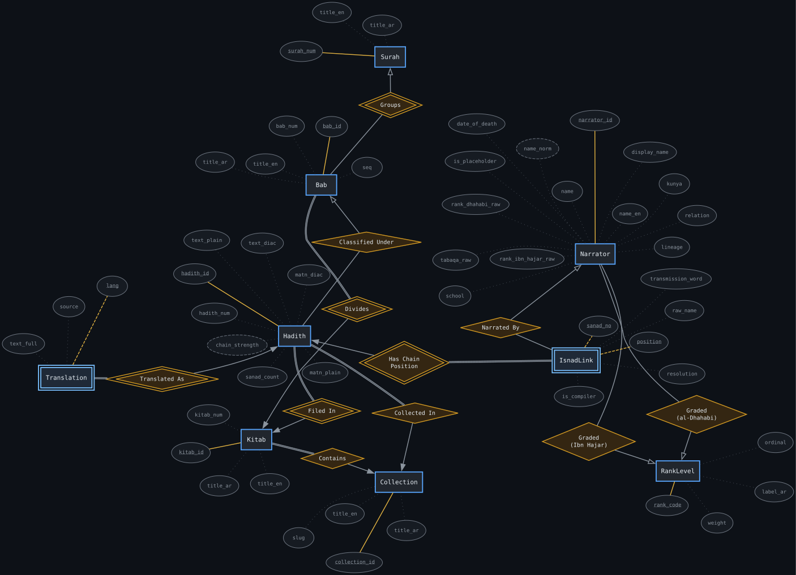
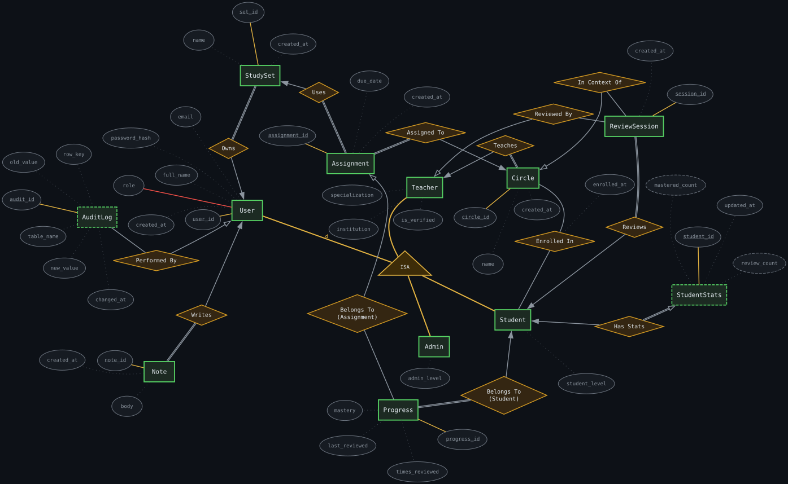
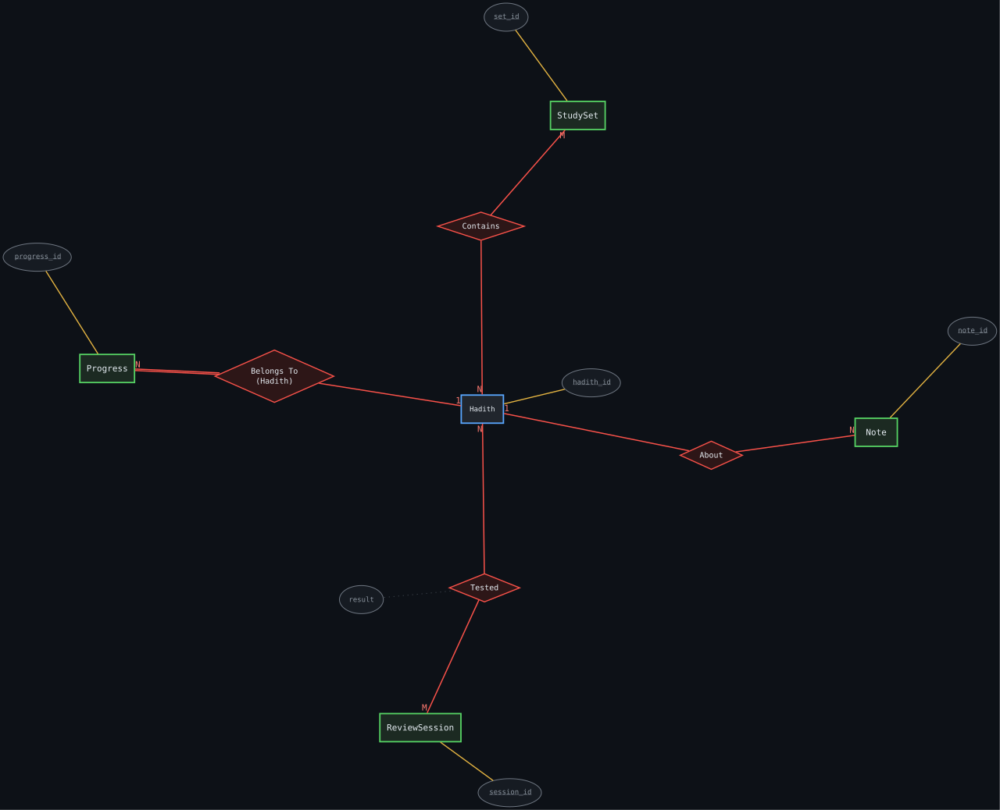
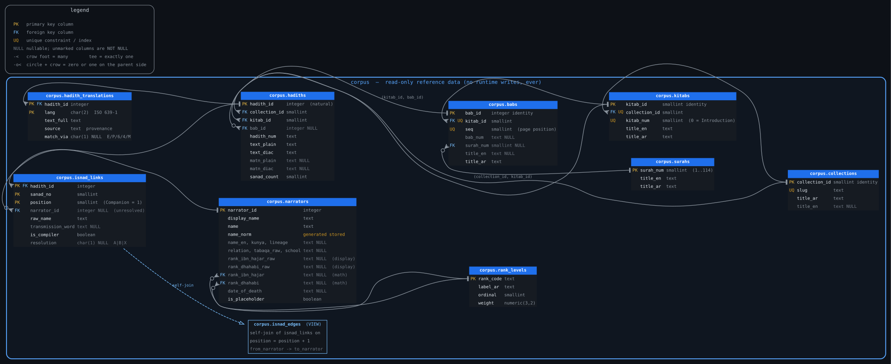
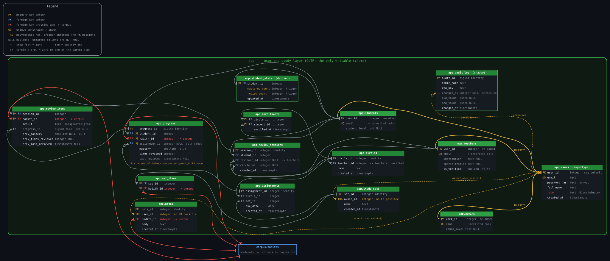

<!-- _class: lead -->
<!-- _paginate: false -->

# Ilham (إلهام)

## A Teacher-Led Hadith Study Platform — Database Design

One database, two opposite workloads, 
kept apart by <b>privilege</b> — not by convention.

2405045 &nbsp;·&nbsp; 2405052 &nbsp;·&nbsp; CSE216

<!--
20 seconds. Do not linger.

"Ilham is a platform where teachers assign classical hadith texts to students
and track their memorisation. The design problem is that it has to hold two
completely different kinds of data at once, and this is how we kept them apart."

Then move. Resist introducing yourselves at length.
-->

---

## The domain, and why it's a modelling problem

A **hadith** is a recorded narration. The **matn** is its text.

The **isnad** is the chain of people who transmitted it:

Companion<i>→</i>…<i>→</i>…<i>→</i>Compiler

Scholars grade those narrators — **and they disagree.**

Corpus: large, shared, never edited. Study activity: small, per-user, written
constantly. **Two opposite profiles, one database.**

<!--
60 seconds. The most compressed slide, and it makes the next three intelligible.

"Every hadith carries its own provenance — the chain isn't metadata about the
text, for this domain it's half the text. That's the reference side: large,
shared, and it never changes. Against it sits student activity: small, per-user,
written constantly. Two opposite profiles, one database."

Without isnad defined here, slide 3 is unreadable to a non-specialist.
-->

---

<!-- _class: corpus -->

## The corpus

<b>A chain position is a weak entity</b>
Identified by <i>(hadith, which chain, position)</i> — stored explicitly,
Companion first, compiler last.

<!--
80 seconds. The longest slide. This is where the marks are.

"Collections hold chapters hold hadiths — that part is ordinary. The interesting
entity is the double-bordered one: a chain position. It can't exist on its own;
it's identified by which hadith, which chain, and where in that chain.

The alternative was a 'this narrator taught that narrator' link, and it fails —
teacher-and-student isn't a fact about a narrator, it's a fact about a narrator
WITHIN ONE SPECIFIC CHAIN. Storing position explicitly makes chains first-class,
and it means walking a chain is plain aggregation rather than recursion."

If five seconds spare: "And note the two separate grading relationships — we
kept both scholars rather than collapsing them, because the disagreement is the
interesting part."

Do NOT enumerate attributes. Do NOT explain 0..1. One point.
-->

---

<!-- _class: app -->

## The study layer

<b>Users specialise</b>
Disjoint: Student / Teacher / Admin. A foreign key to a <i>subtype</i> makes the
rule structural — an admin cannot own a circle.

<b>Progress is grained per (student, hadith, assignment)</b>
A hadith assigned twice is two obligations; prior self-study is never reset.

<!--
70 seconds.

"A teacher owns a circle, students enrol, the teacher assigns a study set, and
that produces progress rows — one per student per hadith.

Two decisions worth pointing at. Users specialise into three subtypes, so a
foreign key pointing at TEACHERS means an admin simply cannot own a circle — the
database enforces the rule with no application code. And progress is grained per
assignment, not per hadith, because the same hadith assigned twice is two
separate obligations."

Cut: inheritance trade-offs, trigger-maintained tables, partial indexes.
-->

---

<!-- _class: cross -->

## The boundary

Everything the study layer knows about the corpus is here.

**Four** relationships, all pointing at hadith — the entire interface between
the two halves.

REVOKE INSERT, UPDATE, DELETE 
&nbsp;&nbsp;ON corpus.* FROM &lt;app role&gt;;

<!--
60 seconds. This slide IS the thesis; everything before was setup.

"This is everything the study layer knows about the corpus. Four relationships,
all pointing at hadith — a set contains them, progress tracks them, a review
tests them, a note is about one. That's the whole interface.

And because it's that narrow, we could revoke write privileges on the corpus
entirely. The distinction I want to leave you with is between a convention and a
guarantee: a comment saying 'don't write here' is a convention; a revoked
privilege is a guarantee. Nothing in the corpus even knows the application
exists."
-->

---

## It's a real schema — and what it guarantees

<figure>

<figcaption>corpus — 7 tables + 1 view</figcaption>
</figure>
<figure>

<figcaption>app — 15 tables</figcaption>
</figure>

<b>Chains are first-class</b>Stored positions, so traversal is aggregation — not recursion.

<b>Disagreement preserved</b>Both scholars' grades kept, never collapsed into one number.

<b>Corpus is read-only</b>Enforced by privilege — no application bug can undo it.

<!--
50 seconds. Evidence plus close.

"Those conceptual models are implemented — every entity is a table, every
relationship a foreign key, and I'm showing these only to make the point that
the design exists as DDL rather than as a drawing.

To close: chains are stored positionally so they're queryable without recursion,
we kept both scholars' grades because the disagreement is the finding, and the
corpus is read-only in a way no application bug can undo. Happy to go deeper on
any of it."

Do NOT invite the audience to read the thumbnails. If someone asks, that's a
good question to get — open the full SVG.
-->
